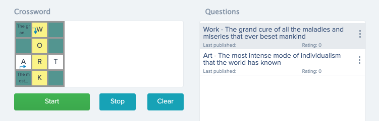

Hi there :clap:
# The CGame Portal
It's a backend for building of crosswords puzzle. 

There are an API. This way the apps get a crossword puzzle.

We use the php, JavaScript, jQuery and the Yii2, Vue.js, Bootstrap 4.

**Design**

Interface mockups are here (Zeplin project): https://zpl.io/2ZJOr51 
(You need an invitation to Zeplin project for more functions, contact to a project manager).

List of numbers screens with descriptions is here: https://docs.google.com/spreadsheets/d/1f45YQu2sqmVc2ZE71S8scbbatBz7ld6t7pGb-yX7Pxc/edit#gid=0

**Addition resources**
Flags of countries (there are the downloaded icons at Files Tab for 196 countries) are here: https://www.countryflags.com/en/
Codes of countries: https://ru.wikipedia.org/wiki/ISO_3166-1
Codes of languages: https://en.wikipedia.org/wiki/List_of_ISO_639-1_codes
